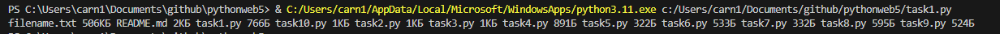
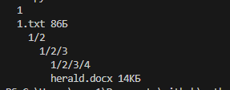
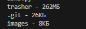
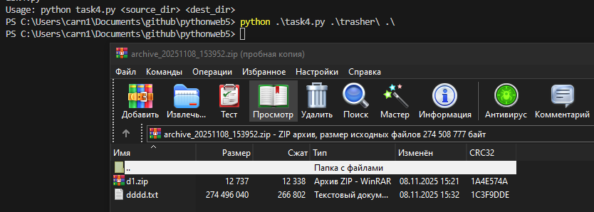
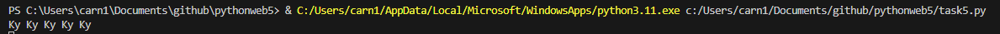
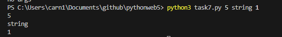
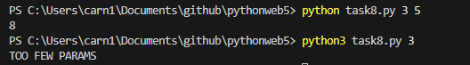
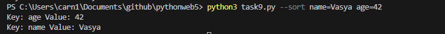
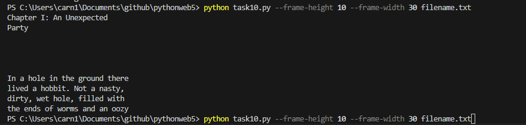

<h1>1) Необходимо получить человекочитаемые размеры всех файлов (за исключением каталогов)
в текущей папке, то есть в папке, из которой запускается ваша программа.</h1>

<h1>2) Напишите программу, на вход которой поступает zip-архив. Вам требуется вывести на
экран его файловую структуру. </h1>

<h1>3) Чистка</h1>

<h1>4) Напишите функцию make_reserve_arc(source, dest).
</h1>

<h1>5) кукушка</h1>

<h1>6) ключ=значение</h1>

<h1>7) Напишите скрипт, который принимает любое кол-во параметров через произвольное
количество пробелов в качестве аргументов и выводит их в той же последовательности на
экран, каждый на отдельной строке</h1>

<h1>8) Напишите программу калькулятор, которая принимает два целочисленных параметра и
считает их сумму. При этом параметры могут быть ошибочными.</h1>

<h1>9) Реализуйте задачу №6, используя библиотеку argparse</h1>

<h1>10) Напишите программу, которая форматирует текстовый файл и выводит его содержимое в
указанных рамках.</h1>

